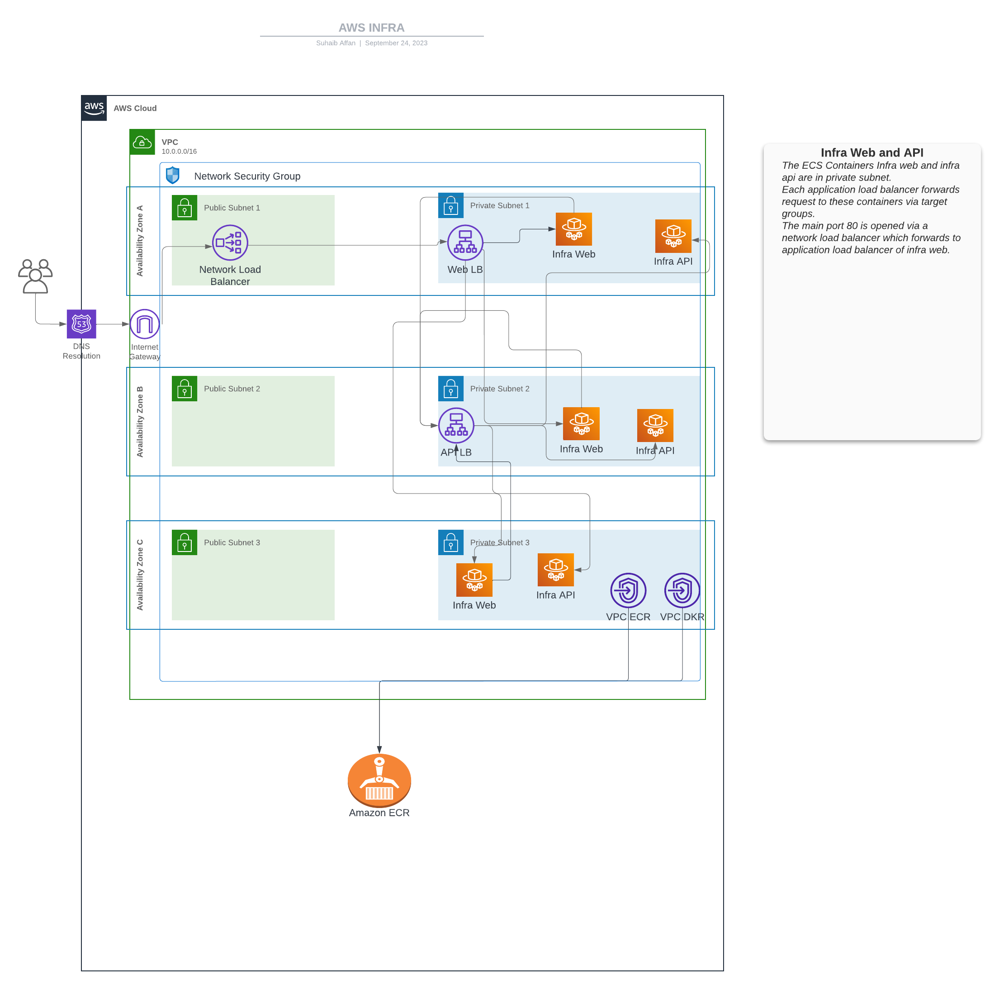
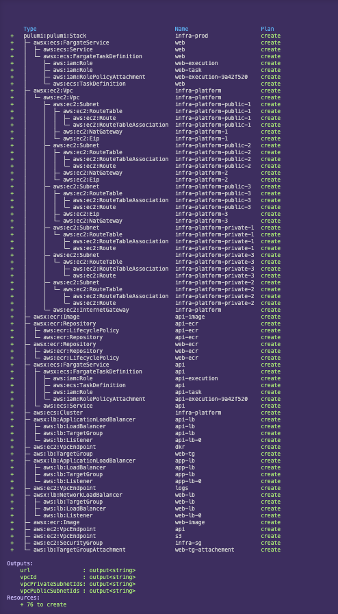

# How to Run

install docker on your machine: [Install Docker](https://docs.docker.com/engine/install/)


Open terminal and run:
```
docker-compose up
```

Open a web browser and navigate to 
```
http://localhost:3000
```


# Application Details

- Web: ASP.NET Core 5.0 Web APP
  - this application requires an environment variabled called "ApiAddress" which will be the address of the Web Api.
- API: ASP.NET Core 5.0 Web API

# Infrastructure Diagram


# Deploy using pulumi
- Make sure the aws and pulumi is configured.
- Make sure to have Node installed
- Run `cd infra`
- Run `npm install`
- Assuming ca-central-1 as the default aws region.
- Setup pulumi with the token.
- Run `pulum stack init prod`
- Run `pulum up`
- Check the preview:

- Once completed, use the loadbalancer url from the output to check the deployment.
